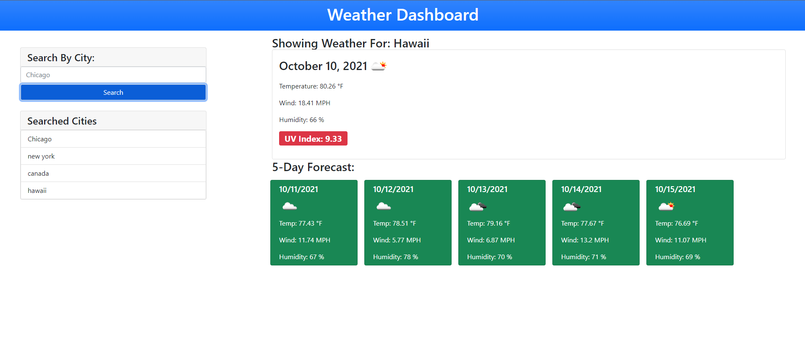

# weather_tracker
Build an app that relies on third party APIs to help users track the weather according to specific locations.

# pseudo code

* Create a weather tracker that provides information for multiple CITIES
* When a user searches a city, weather information for current AND future days are provided
* Weather information for the CURRENT day should provide the following information: City name, date, icon of expected weather, temperature, humidity, wind speed, and UV index
* UV index of CURRENT day should indicate if it is favorable, moderate, or severe
* Weather information for FUTURE days should provide the following information: date, icon of expected weather, temperature, wind speed, and humidity
* Cities searched are to be stored in an interactable history in which the user can revisit any history they looked up
* The weather tracker is to utilize BOTH the openweather API and local storage

# screenshot

# link

https://riveranelson99.github.io/weather_tracker/

## Contributing
Pull requests are welcome. For major changes, please open an issue first to discuss what you would like to change.

Please make sure to update tests as appropriate.